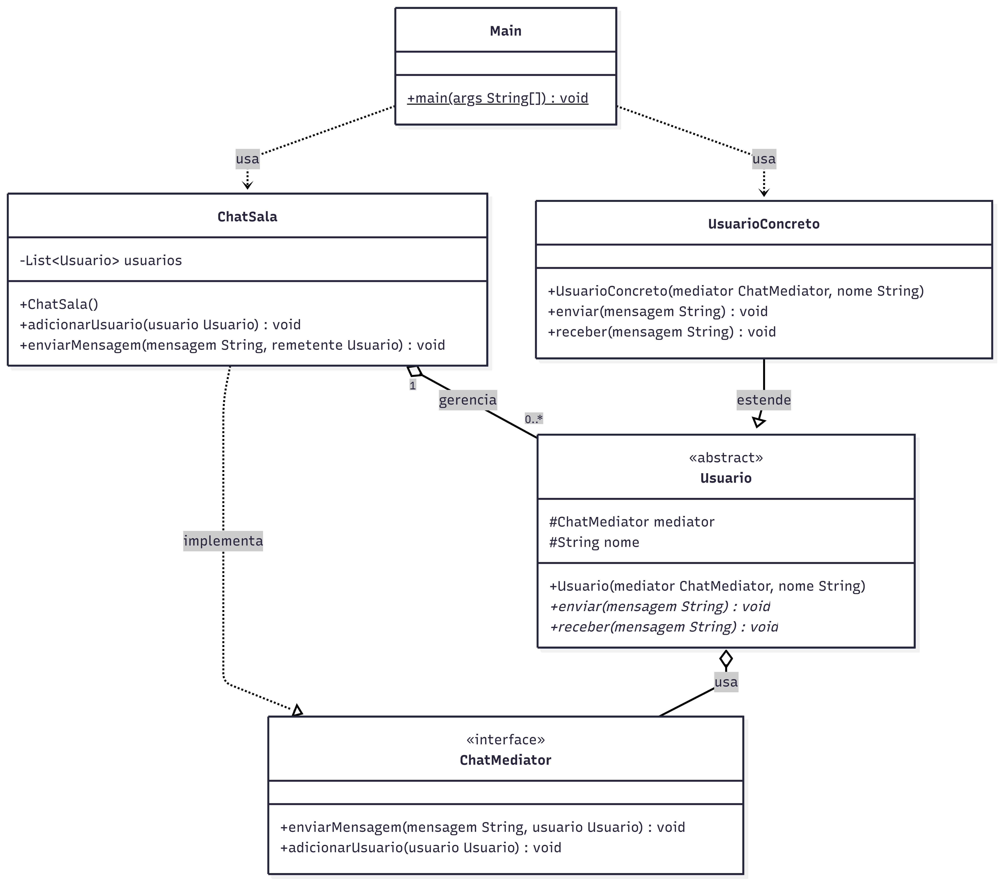

# 💬 Chat com Padrão Mediator

Projeto desenvolvido em Java com o objetivo de demonstrar a aplicação do **padrão de projeto Mediator** em conjunto com o **princípio da responsabilidade única (SRP)**.

---

## 📌 Sobre o projeto

O sistema simula um chat em grupo, onde múltiplos usuários podem trocar mensagens entre si.

A comunicação entre os usuários não ocorre diretamente, sendo intermediada por um mediador central, responsável por distribuir as mensagens. Isso reduz o acoplamento entre as classes e facilita a manutenção do sistema.

---

## 🧱 Estrutura do projeto

```
src/
├── main/
│   └── chat/
│       ├── ChatMediator.java      // Interface do mediador
│       ├── ChatSala.java          // Mediador concreto
│       ├── Usuario.java           // Classe abstrata de usuário
│       ├── UsuarioConcreto.java   // Implementação do usuário
│       └── Main.java              // Execução do sistema
│
└── test/
    └── chat/
        └── ChatMediatorTest.java  // Testes unitários
```

---

## 🧠 Padrões e princípios utilizados

### 🔹 Mediator

Utilizado para centralizar a comunicação entre objetos, evitando que eles se comuniquem diretamente entre si.

No projeto:

* Os usuários não se conhecem diretamente
* Toda comunicação passa pelo `ChatSala`
* O mediador decide quem recebe cada mensagem

---

### 🔹 SRP (Single Responsibility Principle)

Cada classe possui uma única responsabilidade:

* `ChatMediator` → contrato de comunicação
* `ChatSala` → gerenciamento das mensagens
* `Usuario` → definição de comportamento
* `UsuarioConcreto` → implementação do usuário
* `Main` → execução

---

## 📊 Diagrama de Classes



---

## ▶️ Como executar o projeto

### 🔹 Executar a aplicação (Main)

1. Abra o projeto no IntelliJ
2. Navegue até:

   ```
   src/main/chat/Main.java
   ```
3. Clique com o botão direito → **Run 'Main.main()'**

---

### 🧪 Executar os testes

1. Navegue até:

   ```
   src/test/chat/ChatMediatorTest.java
   ```
2. Clique com o botão direito → **Run 'Tests'**

> Certifique-se de que o JUnit 5 está configurado no projeto.

---

## ✅ Exemplo de saída

```
Maria recebeu: Alceu: Olá pessoal!
João recebeu: Alceu: Olá pessoal!
Alceu recebeu: Maria: Oi Alceu!
João recebeu: Maria: Oi Alceu!
```
